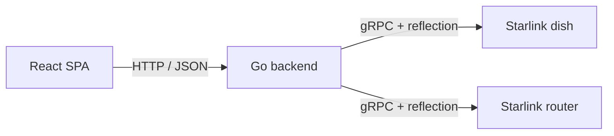

# Nasnet Monitor

[](./LICENSE)
[](https://go.dev/)
[](https://react.dev/)
[](https://www.typescriptlang.org/)
[](https://vitejs.dev/)
[](https://tailwindcss.com/)
[](https://echo.labstack.com/)

A monitoring dashboard for Starlink satellite kits that talks directly to a Starlink dish and router over their (reverse-engineered) gRPC API and presents live telemetry through a polished React dashboard
with a live 3D model of the device.

The project ships as delivers a docker container, so deploying it is just running it on your env with no database or any external services.

---

## Table of contents

- [What it does](#what-it-does)
- [How it works](#how-it-works)
- [Architecture](#architecture)
- [Requirements](#requirements)
- [Quick start](#quick-start)
- [Development](#development)
- [Configuration](#configuration)
- [Contributing](#contributing)
- [License](#license)

---

## What it does

Nasnet Monitor turns your kit's raw gRPC telemetry into a clean, live dashboard. Everything it
shows is **real**, fetched straight from the dish and router and never mocked.

- **Live overview** of the kit's status, headline stats, and a 3D model of the device.
- **Trends over time** for speed, latency, and uptime.
- **Events & outages** recorded by the kit, with the cause of each interruption.
- **On-demand speed tests** measuring download, upload, and latency.
- **Connected devices** on the Wi-Fi network.
- **Obstruction map** showing sky coverage and where the signal is being blocked.
- **Dish alignment** with orientation and aim quality (heading and tilt).
- **Diagnostics** including a raw dish snapshot and radio telemetry.
- **Settings** to manage the kit, network, theme, polling, and device addresses.

## How it works

Starlink dishes and routers expose a private gRPC service, with a single unary method that carries a large `oneof`. Nasnet Monitor:

1. **Discovers the schema live** via gRPC **server reflection** rather than shipping pre-compiled
   protobuf stubs. This means it automatically adapts to whatever firmware version the target
   device is running, so there are no stubs to regenerate when Starlink ships an update.
2. **Exposes a friendly REST API** (`/api/dish/*`) that the frontend calls. Each request can target
   a different device via the `X-Dish-Address` header.
3. **Serves the React SPA** for everything that isn't `/api/`.

The **same endpoints serve two devices**: the **dish** (default `192.168.100.1:9200`) for
telemetry, and the **router** (default `192.168.1.1:9000`) for Wi-Fi client data. They speak the
same reflection API; the frontend just points `X-Dish-Address` at whichever one it needs.

The frontend polls the backend every 5 seconds, transforms the raw device JSON into view models,
and stores the latest snapshot in client state, so every screen reacts to live updates.

## Architecture



- **Backend:** Go + [Echo](https://echo.labstack.com/), layered with constructor dependency
  injection and graceful shutdown.
  gRPC reflection via [`protoreflect`](https://github.com/jhump/protoreflect).
- **Frontend:** Vite + React 18 + TypeScript (strict), Tailwind CSS + shadcn/ui (Radix),
  react-three-fiber / three.js for the 3D scene, react-router-dom, Zustand for state.

## Requirements

- **Go** 1.26+
- **Node.js** 20+ and **npm**
- A reachable Starlink dish and/or router on the network
- For backend linting: [`golangci-lint`](https://golangci-lint.run/); for live-reload dev:
  [`air`](https://github.com/air-verse/air)

## Quick start

Clone the repo and run the two apps in separate terminals.

```bash
# 1) Backend (from main/backend): serves the API on :8080
cd main/backend
make run

# 2) Frontend (from main): Vite dev server on :5173, proxies /api to :8080
cd main
npm install
npm run dev
```

Open <http://localhost:5173>. The Vite dev server proxies `/api` to the Go backend on `:8080`, so
the two talk to each other out of the box.

## Development

### Frontend (run from `main/`)

| Command            | What it does                              |
| ------------------ | ----------------------------------------- |
| `npm run dev`      | Start the Vite dev server (`:5173`)       |
| `npm run build`    | Type-check (`tsc -b`) + production build  |
| `npm run preview`  | Preview the production build              |
| `npm run lint`     | ESLint                                    |
| `npm run format`   | Prettier write                            |
| `npm test`         | Run the Vitest suite once                 |
| `npm run test:watch` | Vitest in watch mode                    |

Run a single test: `npx vitest run frontend/src/path/to/file.test.tsx` or
`npx vitest run -t "test name"`.

### Backend (run from `main/backend/`)

| Command       | What it does                                              |
| ------------- | --------------------------------------------------------- |
| `make run`    | `go run .`                                                 |
| `make dev`    | Live-reload with `air`                                     |
| `make test`   | `go test ./...`                                            |
| `make lint`   | `golangci-lint run`                                        |
| `make fmt`    | Format                                                     |
| `make check`  | **Quality gate:** fmt-check + vet + lint + test + build    |
| `make release`| Embed the built frontend and build a single binary        |

Run a single test: `go test ./internal/starlink -run TestClient_Invoke_Reflection`.

> The backend can be tested **without a real dish**: an in-process gRPC server over `bufconn`
> serves a hand-built `Device` descriptor with reflection enabled, exercising the reflection
> adapter end-to-end.

## Configuration

The backend reads configuration from environment variables (all optional):

| Variable        | Default              | Description                                        |
| --------------- | -------------------- | -------------------------------------------------- |
| `HOST`          | `0.0.0.0`            | Bind address                                       |
| `PORT`          | `8080`               | HTTP port (must be numeric)                        |
| `ENVIRONMENT`   | `development`        | Environment label                                  |
| `DISH_ADDRESS`  | `192.168.100.1:9200` | Fallback gRPC target when no `X-Dish-Address` sent |

Per-request, the gRPC target is chosen by the **`X-Dish-Address`** header (CORS-whitelisted), which
overrides `DISH_ADDRESS`. The frontend uses default ports `9200` (dish) and `9000` (router).

## Contributing

Contributions are welcome. See [CONTRIBUTING.md](./CONTRIBUTING.md) for the development setup,
workflow, and conventions.

## License

[MIT](./LICENSE) © 2026 NASNET Community

---

> **Disclaimer:** This is an independent, fan-made project and is not affiliated with, endorsed by,
> or part of Starlink or SpaceX. "Starlink" and "SpaceX" and any related names, logos, and
> trademarks are the property of their respective owners.
